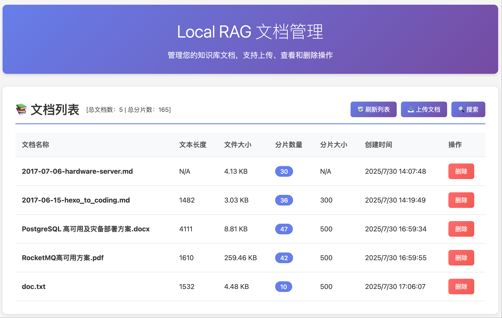

# Local RAG 系统

一个轻量级、纯本地运行的检索增强生成（RAG）知识库系统，专为中文文本优化，支持完全离线部署。

## 🌟 特性

- **完全离线运行**: 无需网络连接，确保数据隐私和安全
- **中文优化**: 使用 jieba 分词和中文优化的嵌入模型
- **高效检索**: 基于向量相似性搜索和重排序的双重检索机制
- **RESTful API**: 提供标准的 HTTP API 接口
- **批量处理**: 支持命令行批量文档导入
- **灵活配置**: 支持多种配置方式和参数调整

## 📋 系统要求

### 硬件要求

- **内存**: 建议 8GB 以上（模型加载需要约 2-3GB）
- **存储**: 至少 5GB 可用空间（模型文件约 2-3GB）
- **CPU**: 支持 AVX 指令集的现代 CPU

### 软件要求

- **Python**: 3.13 或更高版本
- **操作系统**: Linux、macOS 或 Windows
- **包管理器**: uv（推荐）或 pip

## 🚀 快速开始

### 1. 环境准备

#### 安装 uv（推荐）

```bash
# macOS/Linux
curl -LsSf https://astral.sh/uv/install.sh | sh

# Windows
powershell -c "irm https://astral.sh/uv/install.ps1 | iex"
```

#### 或使用 pip

```bash
pip install uv
```

### 2. 项目安装

```bash
# 克隆项目
git clone <repository-url>
cd local-rag

# 创建虚拟环境并安装依赖
uv venv
source .venv/bin/activate  # Linux/macOS
# 或 .venv\Scripts\activate  # Windows

# 安装依赖
uv pip install -r requirements.txt
```

### 3. 模型下载和部署

#### 自动下载脚本（推荐）

```bash
# 创建模型下载脚本
python -c "
import os
from pathlib import Path
from huggingface_hub import snapshot_download

# 创建模型目录
models_dir = Path('models')
models_dir.mkdir(exist_ok=True)

print('下载嵌入模型...')
snapshot_download(
    repo_id='BAAI/bge-small-zh-v1.5',
    local_dir=models_dir / 'bge-small-zh-v1.5',
    local_dir_use_symlinks=False
)

print('下载重排序模型...')
snapshot_download(
    repo_id='BAAI/bge-reranker-base',
    local_dir=models_dir / 'bge-reranker-base',
    local_dir_use_symlinks=False
)

print('模型下载完成！')
"
```

#### 手动下载

1. **嵌入模型 (bge-small-zh-v1.5)**
   - 访问: https://huggingface.co/BAAI/bge-small-zh-v1.5
   - 下载所有文件到 `models/bge-small-zh-v1.5/` 目录

2. **重排序模型 (bge-reranker-base)**
   - 访问: https://huggingface.co/BAAI/bge-reranker-base
   - 下载所有文件到 `models/bge-reranker-base/` 目录

#### 验证模型安装

```bash
python -c "
from app.core.config import settings
print('验证模型路径...')
print(f'嵌入模型: {settings.embedding_model_path} - 存在: {settings.embedding_model_path.exists()}')
print(f'重排序模型: {settings.reranker_model_path} - 存在: {settings.reranker_model_path.exists()}')
"
```

### 4. 启动服务

```bash
# 使用启动脚本（推荐）
python start_server.py

# 或直接启动
uvicorn app.main:app --host 0.0.0.0 --port 8000 --reload
```

服务启动后，访问 http://localhost:8000/docs 查看 API 文档。

## 📁 项目结构

```text
local-rag/
├── app/                    # 应用代码
│   ├── api/               # API 层
│   │   ├── models.py      # 数据模型
│   │   ├── routes.py      # 路由定义
│   │   └── monitoring.py  # 监控中间件
│   ├── core/              # 核心模块
│   │   ├── config.py      # 配置管理
│   │   ├── chunker.py     # 文本分片
│   │   ├── exceptions.py  # 异常定义
│   │   └── logging_config.py # 日志配置
│   ├── services/          # 服务层
│   │   ├── database.py    # 数据库服务
│   │   ├── document_service.py # 文档处理服务
│   │   ├── model_loader.py # 模型加载器
│   │   ├── retriever.py   # 检索服务
│   │   └── vector_store.py # 向量存储
│   ├── middleware/        # 中间件
│   └── main.py           # 应用入口
├── data/                  # 数据存储
│   └── chroma_db/        # ChromaDB 数据文件
├── models/               # 本地模型文件
│   ├── bge-small-zh-v1.5/
│   └── bge-reranker-base/
├── logs/                 # 日志文件
├── scripts/             # 工具脚本
│   └── bulk_ingest.py   # 批量导入脚本
├── tests/               # 测试代码
└── start_server.py      # 启动脚本
```

## ⚙️ 配置说明

### 环境变量配置

项目通过 `.env` 文件进行配置。为了方便起步，您可以复制 `.env.template` 文件来创建自己的配置文件：

```bash
cp .env.template .env
```

然后根据需要编辑 `.env` 文件。

### 配置参数说明

下表列出了所有可用的配置参数及其默认值。

| 参数 | 默认值 | 说明 |
|-------------------------|--------------------------|----------------------------------|
| `DATA_PATH` | `data` | 数据文件基础路径 |
| `EMBEDDING_MODEL_DIR` | `bge-small-zh-v1.5` | 嵌入模型目录名 |
| `RERANKER_MODEL_DIR` | `bge-reranker-base` | 重排序模型目录名 |
| `COLLECTION_NAME` | `documents` | 文档集合名称 |
| `DEFAULT_CHUNK_SIZE` | `500` | 默认分片大小（词元数） |
| `DEFAULT_CHUNK_OVERLAP` | `50` | 默认分片重叠（词元数） |
| `DEFAULT_RETRIEVAL_K` | `10` | 默认候选文档数量 |
| `DEFAULT_TOP_K` | `3` | 默认返回结果数量 |
| `RERANKER_MAX_LENGTH` | `512` | 重排序模型最大序列长度 |
| `LOG_LEVEL` | `INFO` | 日志级别 |
| `LOG_FILE` | `logs/app.log` | 日志文件路径 |
| `API_HOST` | `0.0.0.0` | API 服务主机 |
| `API_PORT` | `8000` | API 服务端口 |
| `SUPPORTED_FORMATS` | `['.txt', '.md', '.pdf', ...]` | 支持的文档格式 (见 .env.template) |

## 📖 API 使用指南

本系统提供了一套完整的 RESTful API 用于文档管理和系统监控。所有 API 端点都支持标准的 HTTP 方法，并返回 JSON 格式的响应。

### 主要 API 功能

- **文档管理**:
  - `POST /api/v1/ingest`: 从本地路径摄取文档。
  - `POST /api/v1/ingest/upload`: 通过文件上传方式摄取文档。
  - `POST /api/v1/ingest/load`: 从本地目录批量摄取文档。
  - `POST /api/v1/retrieve`: 根据查询检索文档片段。
  - `GET /api/v1/documents`: 获取所有已处理的文档列表。
  - `DELETE /api/v1/documents/{document_path}`: 删除指定的文档。
- **系统与监控**:
  - `GET /api/v1/health`: 检查系统健康状态。
  - `GET /api/v1/stats`: 获取系统运行统计数据。
  - `GET /api/v1/monitoring/metrics`: 获取详细的性能指标。
  - `GET /api/v1/monitoring/system`: 获取系统资源使用情况。

### 交互式文档

要查看所有 API 的详细参数、响应模型和在线测试工具，请访问服务启动后自动生成的交互式文档：

- **Swagger UI**: [http://localhost:8000/docs](http://localhost:8000/docs)
- **ReDoc**: [http://localhost:8000/redoc](http://localhost:8000/redoc)

### 详细使用示例

我们提供了详细的 API 使用示例和客户端代码，包括 cURL、Python 和 JavaScript。这些示例可以帮助您快速集成和使用本系统。

请参阅 [**API 使用示例和最佳实践 (docs/API_EXAMPLES.md)**](docs/API_EXAMPLES.md) 获取完整指南。

## 🖥️ 管理界面

本系统内置了一个基于 Web 的管理界面，方便用户进行文档管理和检索测试。



- **管理页面**: [http://localhost:8000/admin](http://localhost:8000/admin)
- **检索页面**: [http://localhost:8000/admin/search](http://localhost:8000/admin/search)

### 功能概览

- **文档列表**: 查看所有已入库的文档，包括路径、分片数量、大小等信息。
- **文件上传**: 直接通过浏览器上传一个或多个文档文件进行处理。
- **文档删除**: 在列表中方便地删除不再需要的文档。
- **实时检索**: 在检索页面输入查询，调整参数（如 Top K、是否使用重排器），并立即看到结果。
- **系统监控**: （规划中）集成系统健康状态和关键指标的可视化图表。

这个界面对于快速验证、内容管理和功能演示非常有用，无需编写任何代码即可与系统的核心功能进行交互。

## 🔧 批量导入工具

### 基本用法

```bash
# 导入单个文件
python scripts/bulk_ingest.py --path documents/example.txt

# 导入整个目录
python scripts/bulk_ingest.py --path documents/

# 自定义分片参数
python scripts/bulk_ingest.py \
  --path documents/ \
  --chunk-size 500 \
  --chunk-overlap 100
```

### 参数说明

| 参数 | 说明 | 默认值 |
|------|------|--------|
| `--path` | 文档路径（文件或目录） | 必需 |
| `--chunk-size` | 分片大小（词元数） | 300 |
| `--chunk-overlap` | 分片重叠（词元数） | 50 |

### 批量导入示例

```bash
# 准备文档目录
mkdir -p documents
echo "这是一个测试文档，用于演示批量导入功能。" > documents/test1.txt
echo "另一个测试文档，包含不同的内容。" > documents/test2.txt

# 执行批量导入
python scripts/bulk_ingest.py --path documents/

# 验证导入结果
curl -X POST "http://localhost:8000/api/v1/retrieve" \
  -H "Content-Type: application/json" \
  -d '{"query": "测试文档"}'
```

## 🧪 测试

### 运行测试套件

```bash
# 运行所有测试
pytest

# 运行特定测试
pytest tests/test_api_integration.py -v

# 运行测试并生成覆盖率报告
pytest --cov=app --cov-report=html

# 运行性能测试
pytest tests/test_performance.py -v
```

### 测试分类

- **单元测试**: 测试各个组件的独立功能
- **集成测试**: 测试组件间的交互
- **API 测试**: 测试 HTTP 接口
- **性能测试**: 测试系统性能指标

## 🔍 故障排除

### 常见问题

#### 1. 模型加载失败

**错误信息**: `ModelLoadError: 无法加载嵌入模型`

**解决方案**:
```bash
# 检查模型文件是否存在
ls -la models/bge-small-zh-v1.5/
ls -la models/bge-reranker-base/

# 验证模型文件完整性
python -c "
from sentence_transformers import SentenceTransformer
model = SentenceTransformer('models/bge-small-zh-v1.5')
print('模型加载成功')
"
```

#### 2. ChromaDB 连接错误

**错误信息**: `DatabaseError: ChromaDB 连接失败`

**解决方案**:
```bash
# 检查数据目录权限
mkdir -p data/chroma_db
chmod 755 data/chroma_db

# 清理损坏的数据库文件
rm -rf data/chroma_db/*
```

#### 3. 内存不足

**错误信息**: `OutOfMemoryError` 或系统卡顿

**解决方案**:
- 减少 `DEFAULT_CHUNK_SIZE` 参数
- 降低 `DEFAULT_RETRIEVAL_K` 参数
- 增加系统内存或使用更小的模型

#### 4. 文档格式不支持

**错误信息**: `ValidationError: 不支持的文件格式`

**解决方案**:
```bash
# 检查支持的格式
python -c "
from app.core.config import settings
print('支持的格式:', settings.SUPPORTED_FORMATS)
"

# 转换文档格式
# 将 .docx 转换为 .txt
pandoc document.docx -o document.txt
```

#### 5. API 端口被占用

**错误信息**: `OSError: [Errno 48] Address already in use`

**解决方案**:
```bash
# 查找占用端口的进程
lsof -i :8000

# 杀死占用进程
kill -9 <PID>

# 或使用不同端口
API_PORT=8001 python start_server.py
```

### 日志分析

#### 查看日志文件

```bash
# 查看应用日志
tail -f logs/app.log

# 查看错误日志
tail -f logs/error.log

# 查看性能日志
tail -f logs/performance.log
```

#### 日志级别调整

```bash
# 启用调试日志
LOG_LEVEL=DEBUG python start_server.py

# 查看详细的处理过程
grep "DocumentProcessor" logs/app.log
```

### 性能优化

#### 1. 调整分片参数

```python
# 较小的分片 - 更精确但检索较慢
chunk_size = 200
chunk_overlap = 30

# 较大的分片 - 检索较快但可能不够精确
chunk_size = 500
chunk_overlap = 100
```

#### 2. 调整检索参数

```python
# 快速检索 - 较少候选文档
retrieval_k = 5
top_k = 2

# 精确检索 - 更多候选文档
retrieval_k = 20
top_k = 5
```

#### 3. 系统监控

```bash
# 监控系统资源使用
htop

# 监控 API 响应时间
curl -w "@curl-format.txt" -X POST "http://localhost:8000/api/v1/retrieve" \
  -H "Content-Type: application/json" \
  -d '{"query": "测试查询"}'
```

## 📖 最佳实践

### 1. 文档准备

- **格式统一**: 使用 UTF-8 编码的 .txt 或 .md 文件
- **内容质量**: 确保文档内容完整、格式规范
- **文件大小**: 单个文件建议不超过 10MB
- **目录结构**: 使用清晰的目录结构组织文档

### 2. 分片策略

- **中文文档**: 使用默认的 300 词元分片大小
- **技术文档**: 可适当增加到 400-500 词元
- **对话数据**: 可减少到 150-200 词元
- **重叠设置**: 保持 15-20% 的重叠比例

### 3. 检索优化

- **查询长度**: 查询文本建议 10-50 个字符
- **关键词选择**: 使用具体的关键词而非泛化词汇
- **结果数量**: 根据应用场景调整 top_k 参数

### 4. 系统维护

- **定期备份**: 备份 `data/chroma_db` 目录
- **日志轮转**: 定期清理或归档日志文件
- **性能监控**: 监控内存使用和响应时间
- **模型更新**: 定期更新到最新的模型版本

## 🤝 贡献指南

### 开发环境设置

```bash
# 安装开发依赖
uv pip install -r requirements.txt
pip install pre-commit

# 设置 pre-commit 钩子
pre-commit install

# 运行代码检查
mypy app/
black app/
flake8 app/
```

### 提交规范

- 使用清晰的提交信息
- 遵循 PEP 8 代码规范
- 添加必要的测试用例
- 更新相关文档

## 📄 许可证

本项目采用 MIT 许可证，详见 [LICENSE](LICENSE) 文件。

## 🆘 获取帮助

- **问题报告**: 在 GitHub Issues 中提交问题
- **功能请求**: 在 GitHub Issues 中提交功能请求
- **文档问题**: 在项目 Wiki 中查找更多信息

---

**注意**: 本系统设计为完全离线运行，请确保在部署前下载所有必需的模型文件。
